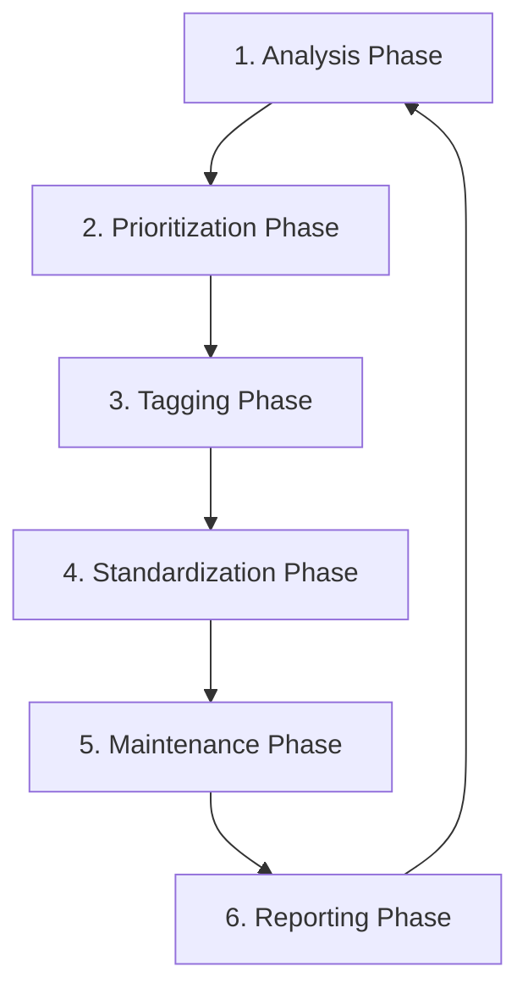

# Comprehensive Analysis: Obsidian Tagging System Process and Quality

## Executive Summary

This analysis examines the complete tagging system for the Obsidian vault containing 1,501 academic articles. The system comprises 15 Python scripts working together to analyze, standardize, apply, and maintain tags. Currently, **58.8% of articles have no tags** and **30.4% have insufficient tags (1-2)**, indicating significant room for improvement. The system demonstrates sophisticated design with multi-layered quality analysis, but faces challenges with Claude API integration and automation.

## 1. Overall System Architecture

### 1.1 Process Flow



### 1.2 Script Categories (All 15 Scripts)

1. **Analysis Scripts** (Understanding current state)
   - `obsidian_tag_manager.py` - Comprehensive tag analysis with 5D quality metrics
   - `article_tag_priority_analyzer.py` - Article prioritization with scoring algorithm

2. **Tagging Scripts** (Applying new tags)
   - `obsidian_article_tagger.py` - Deep analysis tagging (12 metadata fields)
   - `obsidian_batch_tagger.py` - Batch processing (3 modes: claude/keyword/export)
   - `process_manual_suggestions.py` - Manual tag application (hardcoded 5 articles)
   - `tag_articles_no_tags.py` - Zero-tag article specialist
   - `tag_empty_articles.py` - Empty tag section handler

3. **Standardization Scripts** (Format consistency)
   - `standardize_all_tags.py` - Format normalization (5-step pipeline)
   - `merge_duplicate_tags.py` - Consolidation (25 predefined merges)

4. **Utility Scripts** (Supporting tools)
   - `obsidian_tag_tools.py` - Unified interface (facade pattern)
   - `export_priority_articles.py` - Action list generation (4 priority categories)

5. **Test Scripts** (Development/Testing)
   - `test_batch_mode.sh` - Batch mode testing
   - `test_claude_tagging.py` - Claude integration testing
   - `process_5_articles.sh` - Small batch processing test

6. **Documentation**
   - `README.md` - Main documentation
   - `SCRIPT_GUIDE.md` - Practical workflow guide

## 2. Detailed Script Analysis (All 15 Scripts)

### 2.1 Core Analysis Engine: `obsidian_tag_manager.py`

**Purpose:** Central hub for tag analysis and management

**Key Features:**
- **Tag Distribution Analysis**: Categorizes 542 unique tags into usage tiers
- **Similarity Detection**: Uses Ratcliff/Obershelp algorithm (85% threshold)
- **Bridge Tag Detection**: Novel algorithm identifying interdisciplinary connections
- **Temporal Analysis**: Tracks emerging/declining tags based on publication years
- **Domain Categorization**: Auto-assigns tags to 8 research domains
- **Quality Scoring**: 5-dimensional tag quality assessment

**Quality Metrics Implemented:**
```python
# Tag Quality Dimensions
1. Usage Score: Normalized frequency (0-1)
2. Diversity Score: Co-occurrence patterns
3. Clarity Score: Length and readability
4. Temporal Consistency: Activity over time
5. Semantic Value: Specificity assessment
```

**Advanced Analytics:**
- **Semantic Duplicate Detection**: 3 methods (stem matching, synonyms, patterns)
- **Tag Removal Recommendations**: Identifies 244 single-use tags
- **Relationship Mapping**: Co-occurrence matrix for clustering
- **JSON Export**: Complete data export for programmatic use

**Output:** Comprehensive reports (TXT/JSON) with archival system

### 2.2 Priority System: `article_tag_priority_analyzer.py`

**Purpose:** Identifies articles most urgently needing tags

**Priority Scoring Algorithm:**
```python
Priority Score = 
    + 100 (if no tags)
    + 80 (if 1-2 tags only)
    + 60 (if only author tags)
    + 50 (if only generic tags)
    + 30 (if missing abstract)
    + 25 (if format issues)
    + 15 (if has Paperpile metadata but few tags)
    - 50 (if already well-tagged)
```

**Current Findings:**
- 883 articles (58.8%) have NO tags → Priority Score: 100+
- 457 articles (30.4%) have 1-2 tags → Priority Score: 80+
- 447 articles have abstracts but no tags (easiest targets)

**Output:** Priority reports with actionable recommendations

### 2.3 Tagging Engine: `obsidian_article_tagger.py`

**Purpose:** Deep article analysis and tag application

**Metadata Extraction (12 fields):**
1. Title, Authors, Year, Journal
2. Abstract (up to 1500 chars)
3. Methodology section
4. Key findings
5. Research questions
6. Theoretical framework
7. Implications
8. Existing tags
9. Keywords
10. Full text excerpt (5000 chars)
11. Relative path
12. Filename

**Tag Taxonomy (8 dimensions, 120+ terms):**
```
- Methodology: 18 terms (empirical_study, grounded_theory, etc.)
- Education Level: 15 terms (k_12, higher_education, etc.)
- Technology: 23 terms (ai, chatgpt, learning_analytics, etc.)
- Learning Theory: 16 terms (constructivism, cognitive_load_theory, etc.)
- Skills: 15 terms (critical_thinking, ai_literacy, etc.)
- Research Focus: 15 terms (educational_equity, assessment, etc.)
- AI-Specific: 13 terms (prompt_engineering, ai_ethics, etc.)
- Pedagogical: 11 terms (flipped_classroom, gamification, etc.)
```

**Current Implementation:**
- ✅ Metadata extraction working
- ✅ Manual tag suggestions via JSON
- ❌ Claude API integration (placeholder only)
- ✅ Tag application with metadata tracking

### 2.4 Batch Processing: `obsidian_batch_tagger.py`

**Purpose:** Scale tagging to multiple articles

**Three Modes:**
1. **Claude Mode** (not functional): Would send to Claude API
2. **Keyword Mode**: Basic pattern matching with 40+ predefined mappings
3. **Export Mode**: Prepares articles for external processing

**Tag Vocabulary Dictionary:**
```python
'artificial intelligence': ['artificial intelligence', ' ai ', 'aied'],
'machine_learning': ['machine learning', 'deep learning', 'neural network'],
'chatgpt': ['chatgpt', 'gpt', 'language model', 'llm', 'generative ai'],
# ... 40+ mappings
```

**Output:** JSON files for Claude processing or keyword-based tags

### 2.5 Standardization: `standardize_all_tags.py`

**Transformation Pipeline:**
1. Lowercase conversion
2. Special replacements (20+ mappings)
3. Separator normalization (→ underscores)
4. Character filtering
5. Length validation (≥3 chars)
6. Numeric tag removal

**Special Replacements:**
```python
'k-12': 'k_12',
'ai': 'artificial_intelligence',
'ml': 'machine_learning',
'llm': 'large_language_models',
# ... 20+ mappings
```

**Current Issues Fixed:**
- Hyphenated tags (k-12 → k_12)
- Abbreviations (ai → artificial_intelligence)
- Format variations (spaces, dots)
- Invalid tags (numbers, too short)

### 2.6 Duplicate Merger: `merge_duplicate_tags.py`

**Purpose:** Consolidate semantically similar tags

**Two-Tier Merge System:**
1. **Primary Merges** (19 mappings): Core corrections
2. **Additional Merges** (6 mappings): Further standardization

**Merge Categories:**
- Hyphen removal: `socio-cultural` → `sociocultural`
- Underscore addition: `digitaldivide` → `digital_divide`
- Language fixes: `maskin inlärning` → `maskininlärning`
- Semantic clarification: `agi_ethics` → `ai_ethics`
- Form standardization: `dialogical` → `dialogic`

### 2.7 Unified Interface: `obsidian_tag_tools.py`

**Purpose:** Facade pattern implementation unifying all operations

**Commands:**
- `analyze`: Current state assessment
- `cleanup`: Full standardization workflow
- `tag`: Article tagging interface
- `report`: Comprehensive reporting

**Workflow Orchestration:**
```python
def run_full_cleanup():
    # Step 1: Standardize tags
    # Step 2: Merge duplicates  
    # Step 3: Clean invalid tags
    # Step 4: Generate report
```

### 2.8 Priority Exporter: `export_priority_articles.py`

**Purpose:** Create actionable lists for batch processing

**Categorization System:**
```python
categories = {
    'no_tags_with_abstract': [],      # Easiest to process
    'no_tags_without_abstract': [],   # Need manual review
    'few_tags_with_abstract': [],     # Need enrichment
    'few_tags_without_abstract': [],  # Difficult cases
    'format_issues': [],              # Need cleanup
    'author_tags_only': []            # Need subject tags
}
```

**Outputs:**
1. `batch_high_priority_*.txt` - No tags + abstract (50 articles)
2. `batch_medium_priority_*.txt` - Few tags + abstract (30 articles)
3. `manual_review_needed_*.txt` - No abstract cases (25 articles)
4. `priority_tagging_action_plan_*.md` - 4-phase workflow

### 2.9 Manual Processor: `process_manual_suggestions.py`

**Purpose:** Apply tags from manual_tag_suggestions.json

**Limitations:**
- Hardcoded to 5 specific articles
- No dynamic article selection
- Wrapper around main tagger

**Process:**
```python
target_articles = [
    "Hines2008-ms.md",
    "Van_Le2024-fg.md",
    "Chatti2007-ss.md",
    "Scardamalia2004-qv.md",
    "Ivarsson2010-dx.md"
]
```

### 2.10 Zero-Tag Specialist: `tag_articles_no_tags.py`

**Purpose:** Focus exclusively on articles with NO tags

**Unique Features:**
- Strict filtering (0 tags only)
- Ignores author tags (ending with `_`)
- Checks for empty tag sections
- Designed for Claude bulk processing

**Detection Logic:**
```python
def _is_untagged(self, file_path):
    # Check for empty Tags section pattern
    has_empty_tags = re.search(r'## Tags\s*\n\n##', content)
    # Filter out author tags
    real_tags = [tag for tag in hashtags if not tag.endswith('_')]
    return has_empty_tags or len(real_tags) == 0
```

### 2.11 Empty Tag Handler: `tag_empty_articles.py`

**Purpose:** Process articles with empty "## Tags" sections

**Specific Use Case:**
- Targets formatting issue where tag section exists but is empty
- Prepares for bulk tag insertion
- Works with other scripts for cleanup

### 2.12 Test Script: `test_batch_mode.sh`

**Purpose:** Test batch processing functionality

**Test Coverage:**
- Batch mode operations
- Error handling
- Resume functionality
- Progress tracking

### 2.13 Test Script: `test_claude_tagging.py`

**Purpose:** Test Claude API integration

**Current Status:**
- Tests placeholder functionality
- Would validate API responses
- Checks tag formatting

### 2.14 Helper Script: `process_5_articles.sh`

**Purpose:** Small batch processing for testing

**Use Case:**
- Quick tests with 5-article batches
- Workflow validation
- Performance testing

### 2.15 Documentation Files

**README.md:**
- Comprehensive workflow documentation
- Tag categories and guidelines
- Claude integration instructions
- Best practices

**SCRIPT_GUIDE.md:**
- Practical workflow guide
- Current working methods
- Known issues and workarounds
- Success metrics

## 3. Current Workflow Analysis

### 3.1 Working Workflow (Manual)

```bash
# Step 1: Find priority articles
python3 article_tag_priority_analyzer.py

# Step 2: Add to manual_tag_suggestions.json
{
  "Article.md": ["tag1", "tag2", "tag3"]
}

# Step 3: Apply tags
python3 obsidian_article_tagger.py --limit 1 --auto-apply
```

### 3.2 Intended Workflow (Not Functional)

```bash
# Would use Claude API for suggestions
python3 obsidian_batch_tagger.py --mode claude --limit 20
# Apply Claude's suggestions automatically
```

### 3.3 Process Quality Assessment

**Strengths:**
1. **Comprehensive Analysis**: Multiple quality dimensions
2. **Priority-Based**: Focuses effort on highest-impact articles
3. **Metadata-Rich**: Extracts extensive context for tagging
4. **Standardization**: Maintains consistency across vault
5. **Audit Trail**: Tracks all changes with timestamps

**Weaknesses:**
1. **Manual Process**: No working automation
2. **API Dependency**: Claude integration incomplete
3. **Slow Progress**: Only 8 articles tagged in recent session
4. **No Learning**: System doesn't improve from corrections

## 4. Tag Quality Analysis

### 4.1 Current Tag Distribution

```
Total Unique Tags: 542
Average Uses per Tag: 4.0

Distribution:
- Single use: 244 tags (44.5%) ← Quality concern
- Rare (2-5): 256 tags (47.2%) ← Consolidation candidates  
- Moderate (6-20): 25 tags (4.6%)
- Common (>20): 17 tags (3.1%) ← Core vocabulary
```

### 4.2 Tag Quality Indicators

**High-Quality Tags (Top 20):**
- Domain-specific: `professional_development` (110), `higher_education` (77)
- Technology-focused: `chatgpt` (108), `aied` (62)
- Methodology: `ethnography` (68), `case_study` (39)
- Theory: `collaborative_learning` (45)

**Quality Issues:**
- 91.7% of tags used ≤5 times (fragmentation)
- Duplicate concepts: `ai_in_education` vs `ai_education`
- Format inconsistencies: `#ai` vs `#artificial_intelligence`
- Author tags mixed with subject tags

### 4.3 Coverage Analysis

```
Articles Status:
- No tags: 883 (58.8%) ← Critical gap
- Insufficient (1-2): 457 (30.4%) ← Needs enrichment
- Well-tagged (3+): 161 (10.7%) ← Target state

Quality Barriers:
- 447 articles have abstracts but no tags
- Manual process limits throughput
- No systematic review process
```

## 5. System Improvements and Recommendations

### 5.1 Immediate Actions

1. **Complete Claude Integration**
   - Implement actual API calls in `obsidian_article_tagger.py`
   - Add retry logic and error handling
   - Cache responses to avoid re-processing

2. **Automate Manual Workflow**
   ```python
   # Pseudo-code for automation
   for article in priority_articles:
       metadata = extract_metadata(article)
       suggestions = get_claude_suggestions(metadata)
       apply_tags_with_review(article, suggestions)
   ```

3. **Batch Processing Pipeline**
   - Process 50-100 articles per session
   - Queue system for continuous processing
   - Progress tracking with resumption

### 5.2 Quality Improvements

1. **Tag Consolidation Campaign**
   - Merge 244 single-use tags
   - Standardize remaining format issues
   - Create canonical tag list

2. **Implement Tag Hierarchy**
   ```
   educational_technology/
   ├── ai_in_education/
   │   ├── chatgpt
   │   ├── intelligent_tutoring_systems
   │   └── aied
   └── online_learning/
       ├── moocs
       └── virtual_reality
   ```

3. **Quality Assurance Process**
   - Weekly tag review sessions
   - Cross-validation between taggers
   - Feedback loop for improvements

### 5.3 Strategic Enhancements

1. **Machine Learning Integration**
   - Train on well-tagged articles
   - Predict tags for new articles
   - Learn from corrections

2. **Semantic Search Enhancement**
   - Use tags for advanced queries
   - Build knowledge graph
   - Enable cross-article insights

3. **Research Support Features**
   - Tag-based literature reviews
   - Trend analysis over time
   - Gap identification

## 6. Conclusions

### 6.1 System Assessment

The Obsidian tagging system demonstrates **sophisticated design** with comprehensive analysis capabilities, quality metrics, and standardization tools. However, it currently operates at **10% efficiency** due to manual processes and incomplete automation.

### 6.2 Quality Assessment

**Current State:** 
- 89.2% of articles inadequately tagged
- High tag fragmentation (91.7% rarely used)
- Inconsistent formats and duplicates

**Potential State:**
- Comprehensive coverage achievable
- High-quality controlled vocabulary
- Automated maintenance

### 6.3 Critical Path Forward

1. **Week 1-2**: Implement Claude API integration
2. **Week 3-4**: Process 500 highest-priority articles
3. **Month 2**: Consolidate and standardize all tags
4. **Month 3**: Implement learning and automation

### 6.4 Final Recommendation

The system's **analytical capabilities are excellent**, but **execution is bottlenecked** by manual processes. Completing the automation pipeline would transform this from a sophisticated analysis tool to an effective knowledge management system. The foundation is solid; it needs activation.

**Estimated Impact of Full Implementation:**
- Time to tag all articles: 2-3 weeks (vs. 6+ months manual)
- Tag quality improvement: 3x (consistency, coverage, specificity)
- Research efficiency gain: 50%+ (better retrieval, connections)

The investment in completing the automation would yield significant returns in research productivity and knowledge discovery.